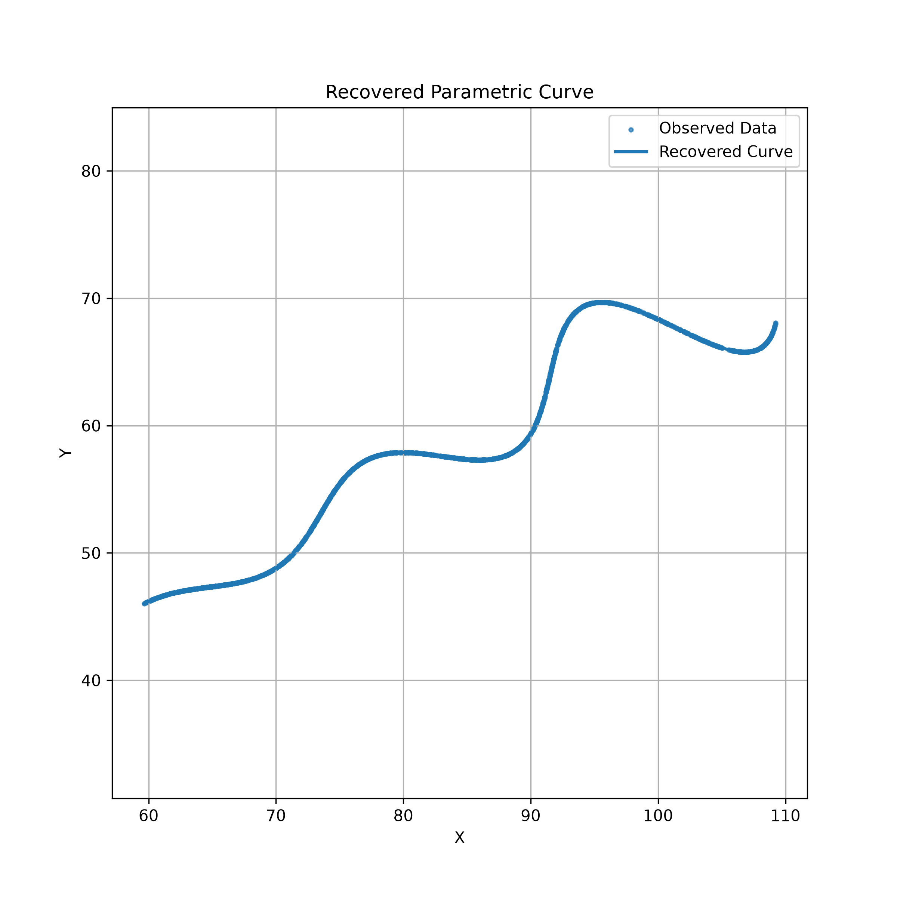
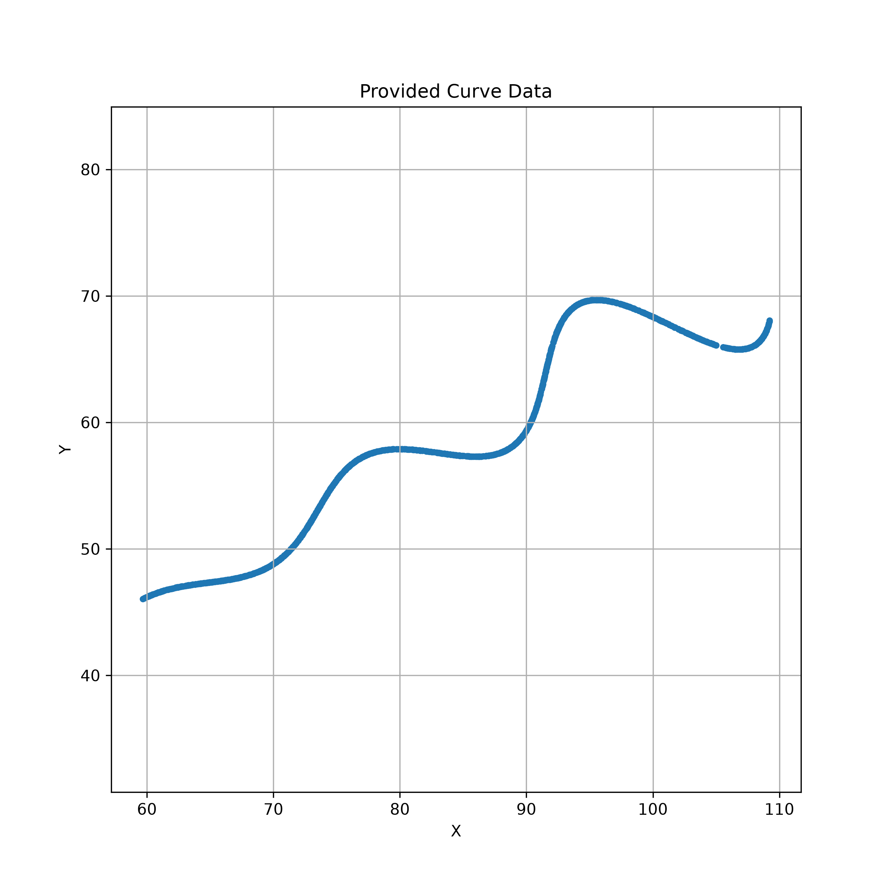
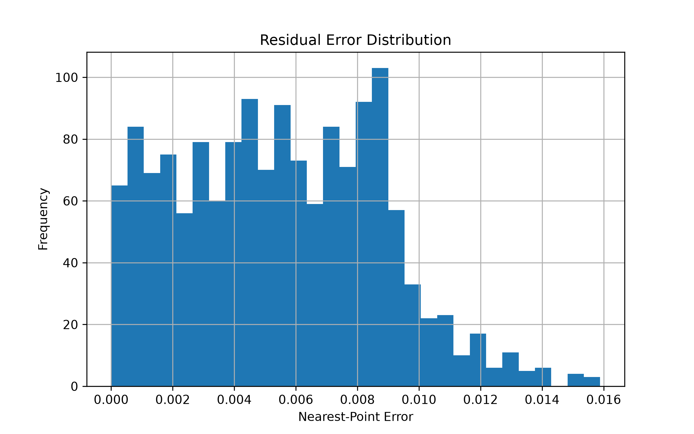

# FlamApp AI – Research & Development Assignment

## Overview

This project solves the FlamApp AI Research & Development assignment by estimating the unknown parameters of a parametric curve from a given set of 2D points.

The unknown parameters are:

- θ (Rotation Angle)
- M (Exponential Growth Factor)
- X (Horizontal Translation)

The objective is to recover these parameters such that the generated curve closely matches the provided dataset.

---

## Mathematical Model

The parametric equations are

\[
x=t\cos(\theta)-e^{M|t|}\sin(0.3t)\sin(\theta)+X
\]

\[
y=42+t\sin(\theta)+e^{M|t|}\sin(0.3t)\cos(\theta)
\]

where

```
6 ≤ t ≤ 60
```

Unknown variables

```
θ
M
X
```

---

## Methodology

The solution consists of the following stages:

1. Load the provided dataset.
2. Implement the mathematical model.
3. Generate the parametric curve.
4. Define an objective function.
5. Match unordered points using a KD-Tree nearest-neighbour search.
6. Recover the parameters using Differential Evolution.
7. Validate the recovered curve visually.
8. Export the recovered parameters and error metrics.

---

## Why Differential Evolution?

The optimization problem is nonlinear and contains three continuous variables.

Differential Evolution was selected because:

- It performs global optimization.
- It does not require gradient information.
- It is robust for nonlinear objective functions.
- It works well with bounded search spaces.

---

## Why KDTree?

The points in `xy_data.csv` are unordered.

Instead of comparing point-by-point, the nearest-neighbour distance between the observed and predicted curves is computed using `scipy.spatial.cKDTree`.

This produces a robust approximation of the L1 distance between both curves.

---

## Results

Recovered Parameters

| Parameter | Value |
|-----------|------:|
| θ | 30.00003627° |
| M | 0.03000046 |
| X | 55.00001394 |

Average nearest-point error

```
0.0054797646
```

---

## Project Structure

```text
data/
outputs/
src/

README.md
requirements.txt
```

---

## How to Run

Install dependencies

```bash
pip install -r requirements.txt
```

Run optimization

```bash
python src/optimizer.py
```

Generate visualizations

```bash
python src/visualize.py
```

---

## Output

The project generates

- comparison.png
- original_curve.png
- residual_histogram.png
- parameters.txt
- results.json

---

## Results

### Curve Comparison



### Original Dataset



### Residual Distribution



## Future Improvements

- Multi-objective optimization
- Bayesian Optimization
- GPU acceleration
- Automatic parameter confidence intervals

---

Developed as part of the FlamApp AI Research & Development Assignment.
